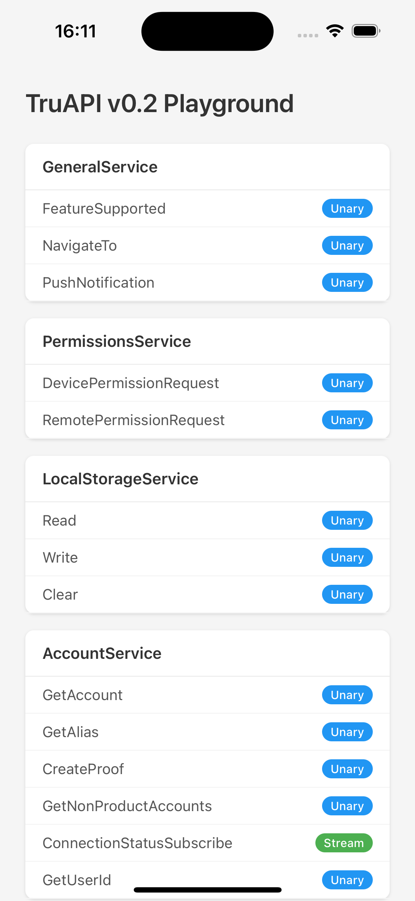
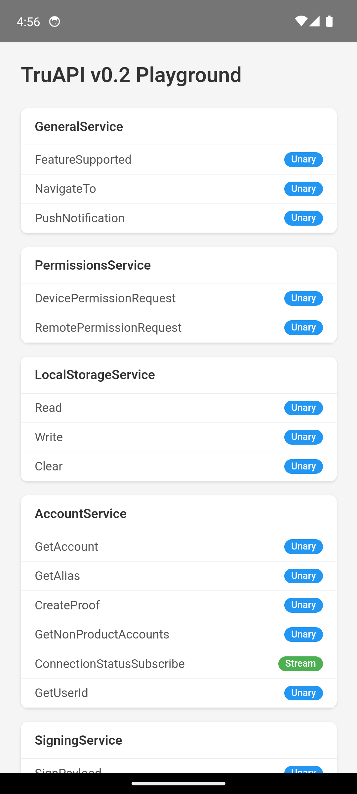
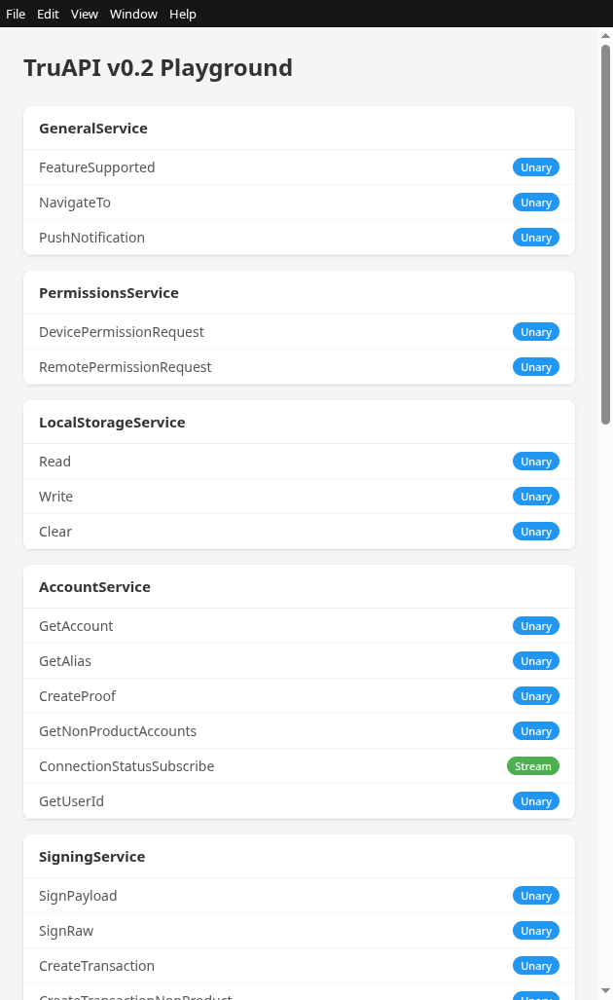
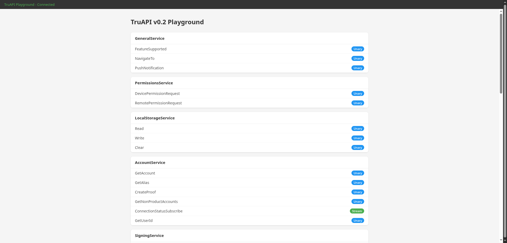
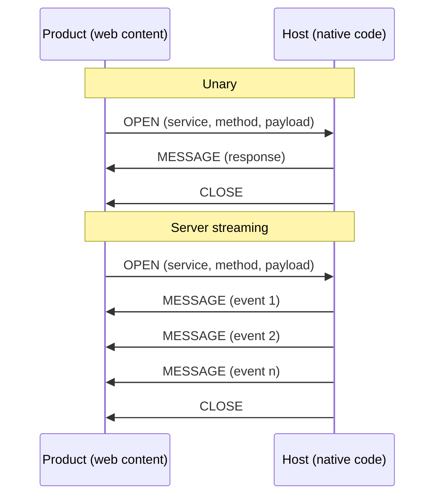

<div align="center">

# RPC Bridge

*Type-safe, streaming RPC between web content and native hosts, on every platform.*

[](#testing)
[](https://www.typescriptlang.org/)

| iOS | Android | Electron | Web |
|:---:|:-------:|:--------:|:---:|
|  |  |  |  |

</div>

---

RPC Bridge connects sandboxed product apps to their native host through platform-native IPC.

## Benefits

- **One schema, every platform**: A single `.proto` defines the entire API. Codegen produces typed stubs for TypeScript, Swift, and Kotlin. No protocol drift, no per-platform re-implementation.
- **Minimal hand-written code**: Only service handlers are written by hand. Client stubs, server dispatchers, message types, and serialization are all generated.
- **Streaming built in**: Unary, server-streaming, client-streaming, and bidirectional patterns are first-class, with a formal stream lifecycle (open, half-close, close, cancel, error). Subscriptions and push events are just streams.
- **Platform-native transports**: MessagePort, WKWebView handlers, Android WebView interfaces, Electron IPC. Structured clone where available, JSON strings where not.
- **Forward-compatible**: Unknown fields and frame types are silently ignored. New methods return UNIMPLEMENTED to old clients.

## Comparison with Existing Implementations

The Host API is currently spread across five repos, each hand-writing its own types, codecs, and dispatch logic.

| | Current | RPC Bridge |
|---|---|---|
| **Schema** | Hand-written per repo and language | Single `.proto`, codegen for TS + Swift + Kotlin |
| **Adding a method** | Coordinated changes across up to 5 repos | Add to `.proto`, re-run codegen |
| **Streaming** | Server-push subscriptions only | Unary, server, client, and bidirectional |
| **Platforms** | Each repo covers one platform | Web, iOS, Android, Electron from one codebase |
| **Cross-language safety** | Nothing enforces agreement between repos | All languages derive types from the same schema |

## Usage

### Define a service

> The demo implements the full TruAPI v0.2 surface: 11 services covering accounts, signing, payments, chat, chain operations, and more. Below are excerpts from three of them to illustrate the different RPC patterns.

```protobuf
syntax = "proto3";
package truapi.v02;

// --- LocalStorageService: unary RPCs for a scoped key-value store ---

service LocalStorageService {
  rpc Read(StorageReadRequest) returns (StorageReadResponse);
  rpc Write(StorageWriteRequest) returns (StorageWriteResponse);
  rpc Clear(StorageClearRequest) returns (StorageClearResponse);
}

message StorageReadRequest {
  string key = 1;
}

message StorageReadResponse {
  oneof result {
    StorageReadValue value = 1;
    StorageError error = 2;
  }
}

// --- PaymentService: server-streaming balance and status subscriptions ---

service PaymentService {
  rpc BalanceSubscribe(PaymentBalanceRequest) returns (stream PaymentBalanceEvent);
  rpc TopUp(PaymentTopUpRequest) returns (PaymentTopUpResponse);
  rpc Request(PaymentRequestMsg) returns (PaymentRequestResponse);
  rpc StatusSubscribe(PaymentStatusRequest) returns (stream PaymentStatusEvent);
}

// --- ChatService: includes a bidirectional custom-render stream ---

service ChatService {
  rpc CreateRoom(ChatRoomRequest) returns (ChatRoomResponse);
  rpc PostMessage(ChatPostMessageRequest) returns (ChatPostMessageResponse);
  rpc ListSubscribe(ChatListRequest) returns (stream ChatRoomList);
  rpc ActionSubscribe(ChatActionRequest) returns (stream ReceivedChatAction);
  rpc CustomRenderSubscribe(stream CustomRendererNode) returns (stream CustomMessageRenderRequest);
}
```

### Generate code from proto

```bash
rpc-bridge-codegen \
  --proto 'demos/proto/truapi/v02/*.proto' \
  --proto-path demos/proto \
  --ts-out demos/proto/generated \
  --swift-out packages/rpc-core-swift/Sources/RpcBridge/Generated
```

### Implement the server (host side)

```typescript
import type { ILocalStorageServiceHandler } from './generated/server';
import type { StorageReadRequest, StorageReadResponse, StorageWriteResponse, StorageClearResponse } from './generated/messages';

const store = new Map<string, Uint8Array>();

const localStorageHandler: ILocalStorageServiceHandler = {
  async read(req: StorageReadRequest): Promise<StorageReadResponse> {
    const value = store.get(req.key);
    if (value !== undefined) {
      return { result: { case: 'value', value: { data: value } } };
    }
    return { result: { case: 'error', value: { code: 0, reason: 'Key not found' } } };
  },
  async write(req): Promise<StorageWriteResponse> {
    store.set(req.key, new TextEncoder().encode(JSON.stringify(req.value)));
    return { result: { case: 'ok' } };
  },
  async clear(req): Promise<StorageClearResponse> {
    store.delete(req.key);
    return { result: { case: 'ok' } };
  },
};
```

The playground demo registers all 11 services at once via a shared `registerAllServices` helper:

```typescript
import { registerAllServices } from './setup-server';

const server = new RpcServer({ transport });
registerAllServices(server);
```

### Call from the client (product side)

```typescript
import { LocalStorageServiceClient, PaymentServiceClient, ChatServiceClient } from './generated/client';

// --- Unary: read from local storage ---
const storage = new LocalStorageServiceClient(rpcClient);
const response = await storage.read({ key: 'user-prefs' });

// --- Server streaming: subscribe to payment balance updates ---
const payments = new PaymentServiceClient(rpcClient);
for await (const event of payments.balanceSubscribe({})) {
  if (event.result.case === 'balance') {
    console.log(`Available: ${event.result.value.available}`);
  }
}

// --- Bidirectional streaming: custom chat message rendering ---
const chat = new ChatServiceClient(rpcClient);
async function* renderNodes() {
  // Product sends rendered UI nodes back to the host as they are built.
  yield { node: { case: 'text' as const, value: { modifiers: [], children: [] } } };
}
for await (const req of chat.customRenderSubscribe(renderNodes())) {
  console.log(`Render request for message ${req.messageId} (type: ${req.messageType})`);
}
```

## Getting Started

<details>
<summary>Prerequisites</summary>

- Node.js 20+, npm 9+
- For iOS: Xcode with Swift Package Manager
- For Android: Android Studio with Gradle

</details>

```bash
npm install
npm run build     # core -> codegen -> generate -> transports -> playground
```

### Web (iframe + MessagePort)

```bash
cd demos/host-playground && npm run serve
# Open http://localhost:3000
```

### Electron (MessageChannelMain)

```bash
npx electron demos/host-playground/dist/electron/host-electron.js
```

### iOS (WKWebView)

Open `demos/host-playground/ios/Package.swift` in Xcode.

### Android (WebView)

Open `demos/host-playground/android/` in Android Studio.

## Testing

```bash
# Unit and integration tests
npm test

# E2e tests (web demo, requires Playwright)
npm run test:e2e
```

The test suite covers frame encoding/decoding, stream lifecycle, all four RPC patterns over loopback transport, cancellation (AbortSignal, deadlines, transport close), and forward/backward compatibility.

## Repository Structure

```
proto/rpc/bridge/v1/frame.proto     Wire protocol definition
packages/
  rpc-core/                         Core runtime (frame codec, client, server, streams)
  codegen/                          Proto parser + TS/Swift/Kotlin generators
  rpc-core-swift/                   Swift frame codec + server runtime
  rpc-core-android/                 Android frame codec + server runtime
  transport-web/                    MessagePort + postMessage transports
  transport-ios/                    WKWebView transport (JS side)
  transport-android/                Android WebView transport (JS side)
  transport-electron/               Electron main + preload transports
demos/
  proto/truapi/v02/*.proto          TruAPI v0.2 service definitions (11 services)
  proto/generated/                  Generated TS messages, client stubs, server interfaces
  host-playground/                  Playground demo (shared product UI + per-platform hosts)
    src/setup-server.ts               Registers all 11 mock services on an RpcServer
    src/setup-client.ts               Creates typed clients and renders the React UI
    src/mocks/                        Mock handler implementations per service
    src/host.ts                       Web host (MessagePort to iframe)
    src/host-electron.ts              Electron host (MessageChannelMain)
    src/bootstrap-ios.ts              iOS bootstrap (WKWebView transport)
    src/bootstrap-android.ts          Android bootstrap (WebView transport)
    web/                              Static HTML for the web host
    ios/                              Xcode project (Swift, WKWebView)
    android/                          Android Studio project (Gradle, WebView)
tests/                              Unit and integration tests
e2e/                                Playwright e2e tests
docs/                               Design and architecture docs
```

## How It Works

Each RPC call gets a unique stream ID. Frames flow in both directions over platform-native message passing.



Each platform uses the most efficient channel available: structured clone for web/Electron, JSON strings for iOS/Android.

## Documentation

- **[Architecture](docs/ARCHITECTURE.md)**: System design, layers, component interactions
- **[Wire Protocol](docs/PROTOCOL.md)**: Frame format, types, stream lifecycle, error codes
- **[Compatibility](docs/COMPATIBILITY.md)**: Versioning, forward/backward compatibility
- **[Code Generation](docs/CODEGEN.md)**: Proto parser, generated output per language
- **[Platform Bridges](docs/PLATFORM-BRIDGES.md)**: Transport implementations, encoding, security
- **[Tradeoffs](docs/TRADEOFFS.md)**: Limitations, future extensions, performance
