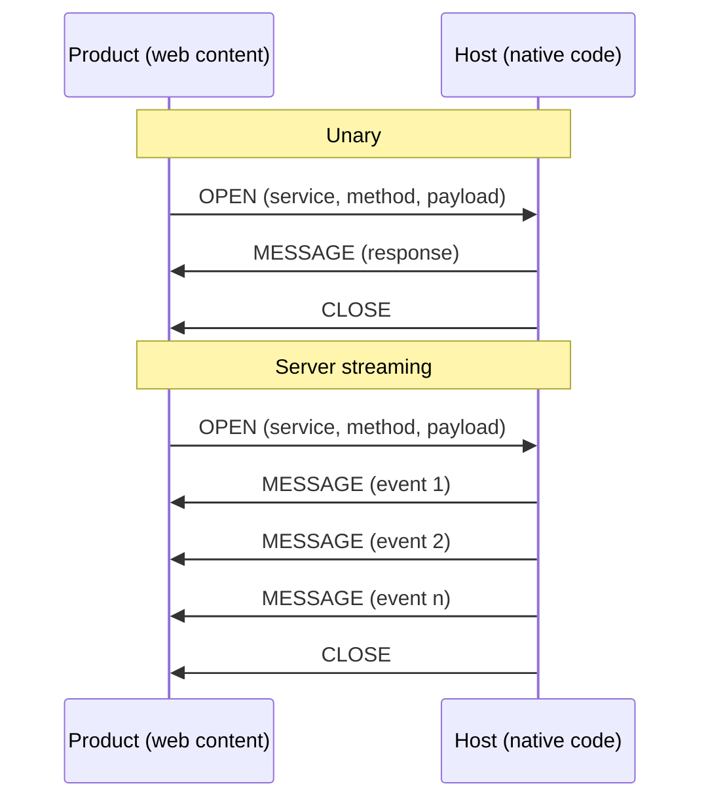

<div align="center">

# RPC Bridge

*Type-safe, streaming RPC between web content and native hosts, on every platform.*

[](#testing)
[](https://www.typescriptlang.org/)

</div>

---

RPC Bridge connects sandboxed product apps to their native host through platform-native IPC.

## Benefits

- **One schema, every platform**: A single `.proto` defines the entire API. Codegen produces typed stubs for TypeScript, Swift, and Kotlin. No protocol drift, no per-platform re-implementation.
- **Minimal hand-written code**: Only service handlers are written by hand. Client stubs, server dispatchers, message types, and serialization are all generated.
- **Streaming built in**: Unary, server-streaming, client-streaming, and bidirectional patterns are first-class, with a formal stream lifecycle (open, half-close, close, cancel, error). Subscriptions and push events are just streams.
- **Platform-native transports**: MessagePort, WKWebView handlers, Android WebView interfaces, Electron IPC. Structured clone where available, JSON strings where not.
- **Forward-compatible**: Unknown fields and frame types are silently ignored. New methods return UNIMPLEMENTED to old clients.

## Comparison with Existing Implementations

The Host API is currently spread across five repos, each hand-writing its own types, codecs, and dispatch logic.

| | Current | RPC Bridge |
|---|---|---|
| **Schema** | Hand-written per repo and language | Single `.proto`, codegen for TS + Swift + Kotlin |
| **Adding a method** | Coordinated changes across up to 5 repos | Add to `.proto`, re-run codegen |
| **Streaming** | Server-push subscriptions only | Unary, server, client, and bidirectional |
| **Platforms** | Each repo covers one platform | Web, iOS, Android, Electron from one codebase |
| **Cross-language safety** | Nothing enforces agreement between repos | All languages derive types from the same schema |

## Usage

### Define a service

> The demo uses a simple `HelloBridgeService` to illustrate all four RPC patterns. In practice, this framework is designed to implement the full TrUAPI surface: define the services in `.proto`, generate stubs for every platform, and replace the per-platform hand-written implementations with a single codegen pipeline.

```protobuf
syntax = "proto3";
package demo.hello.v1;

message HelloRequest {
  string name = 1;
}

message HelloResponse {
  string message = 1;
  uint64 timestamp = 2;
}

service HelloBridgeService {
  rpc SayHello(HelloRequest) returns (HelloResponse);
  rpc WatchGreeting(GreetingStreamRequest) returns (stream GreetingEvent);
  rpc Chat(stream ChatMessage) returns (stream ChatMessage);
}
```

### Generate code from proto

```bash
rpc-bridge-codegen \
  --proto demos/proto/hello.proto \
  --ts-out demos/proto/generated \
  --swift-out demos/host/ios/RPCBridgeDemo/generated \
  --kotlin-out demos/host/android/generated
```

### Implement the server (host side)

```typescript
import { RpcServer } from '@rpc-bridge/core';
import { registerHelloBridgeService } from './generated/server';
import type { IHelloBridgeServiceHandler } from './generated/server';

const handler: IHelloBridgeServiceHandler = {
  async sayHello(request, context) {
    return { message: `Hello, ${request.name}!`, timestamp: BigInt(Date.now()), serverVersion: '1.0' };
  },
  async *watchGreeting(request, context) {
    for (let i = 0; i < request.maxCount; i++) {
      if (context.signal.aborted) break;
      yield { message: `Hello #${i + 1}`, seq: BigInt(i + 1), timestamp: BigInt(Date.now()) };
      await delay(request.intervalMs);
    }
  },
  async collectNames(requests, context) {
    const names: string[] = [];
    for await (const req of requests) names.push(req.name);
    return { message: `Hello ${names.join(', ')}!`, count: names.length };
  },
  async *chat(requests, context) {
    for await (const msg of requests) {
      yield { from: 'host', text: `Echo: ${msg.text}`, seq: msg.seq, timestamp: BigInt(Date.now()) };
    }
  },
};

const server = new RpcServer({ transport });
server.registerService(registerHelloBridgeService(handler));
```

### Call from the client (product side)

```typescript
import { HelloBridgeServiceClient } from './generated/client';

const client = new HelloBridgeServiceClient(rpcClient);

// Unary
const response = await client.sayHello({ name: 'World', language: 'en' });

// Server streaming
for await (const event of client.watchGreeting({ name: 'World', maxCount: 5, intervalMs: 1000 })) {
  console.log(event.message);
}

// Bidirectional streaming: chat() takes an AsyncIterable and returns an AsyncGenerator
async function* outgoing() {
  yield { from: 'guest', text: 'Hello!', seq: 1n, timestamp: BigInt(Date.now()) };
}
for await (const msg of client.chat(outgoing())) {
  console.log(`${msg.from}: ${msg.text}`);
}
```

## Getting Started

<details>
<summary>Prerequisites</summary>

- Node.js 20+, npm 9+
- For iOS: Xcode with Swift Package Manager
- For Android: Android Studio with Gradle

</details>

```bash
npm install
npm run build     # core -> codegen -> generate -> transports -> demos
```

### Web (iframe + MessagePort)

```bash
cd demos/host/web && npm run serve
# Open http://localhost:3000
```

### Electron (MessageChannelMain)

```bash
cd demos/host/electron && npm run start
```

### iOS (WKWebView)

Open `demos/host/ios/Package.swift` in Xcode.

### Android (WebView)

Open `demos/host/android/` in Android Studio.

## Testing

```bash
# Unit and integration tests
npm test

# E2e tests (web demo, requires Playwright)
npm run test:e2e
```

The test suite covers frame encoding/decoding, stream lifecycle, all four RPC patterns over loopback transport, cancellation (AbortSignal, deadlines, transport close), and forward/backward compatibility.

## Repository Structure

```
proto/rpc/bridge/v1/frame.proto     Wire protocol definition
packages/
  rpc-core/                         Core runtime (frame codec, client, server, streams)
  codegen/                          Proto parser + TS/Swift/Kotlin generators
  rpc-core-swift/                   Swift frame codec + server runtime
  rpc-core-android/                 Android frame codec + server runtime
  transport-web/                    MessagePort + postMessage transports
  transport-ios/                    WKWebView transport (JS side)
  transport-android/                Android WebView transport (JS side)
  transport-electron/               Electron main + preload transports
demos/
  proto/hello.proto                 Demo service definition
  product-app/                        Shared product web client (React)
  host/{web,ios,electron,android}/  Platform-specific host implementations
tests/                              Unit and integration tests
e2e/                                Playwright e2e tests
docs/                               Design and architecture docs
```

## How It Works

Each RPC call gets a unique stream ID. Frames flow in both directions over platform-native message passing.



Each platform uses the most efficient channel available: structured clone for web/Electron, JSON strings for iOS/Android.

## Documentation

- **[Architecture](docs/ARCHITECTURE.md)**: System design, layers, component interactions
- **[Wire Protocol](docs/PROTOCOL.md)**: Frame format, types, stream lifecycle, error codes
- **[Compatibility](docs/COMPATIBILITY.md)**: Versioning, forward/backward compatibility
- **[Code Generation](docs/CODEGEN.md)**: Proto parser, generated output per language
- **[Platform Bridges](docs/PLATFORM-BRIDGES.md)**: Transport implementations, encoding, security
- **[Tradeoffs](docs/TRADEOFFS.md)**: Limitations, future extensions, performance

